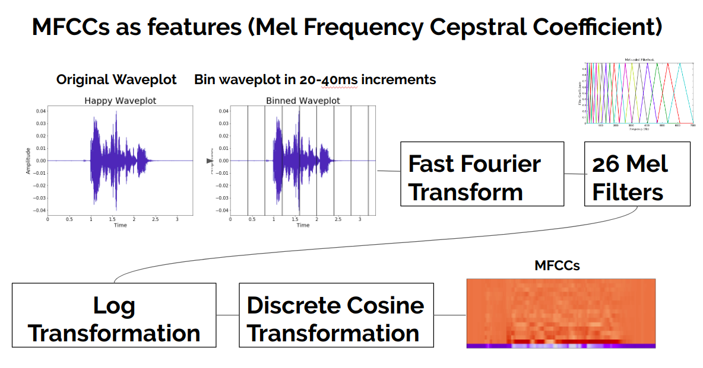
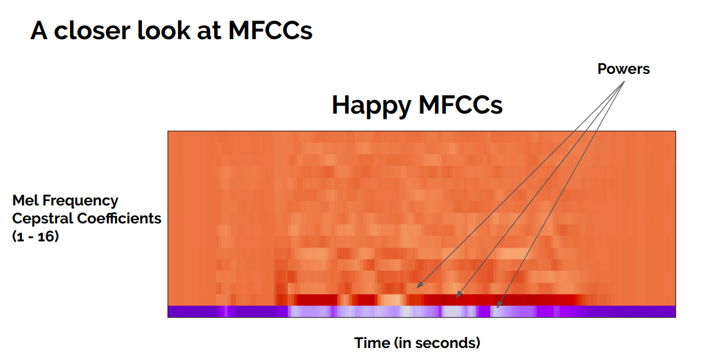
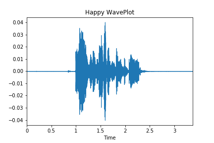
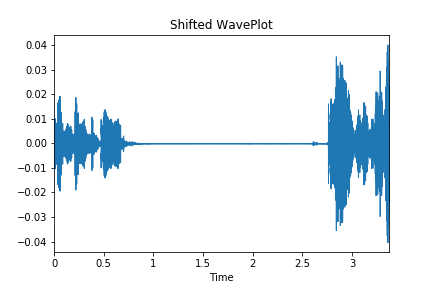
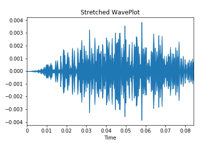
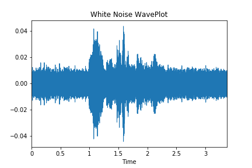
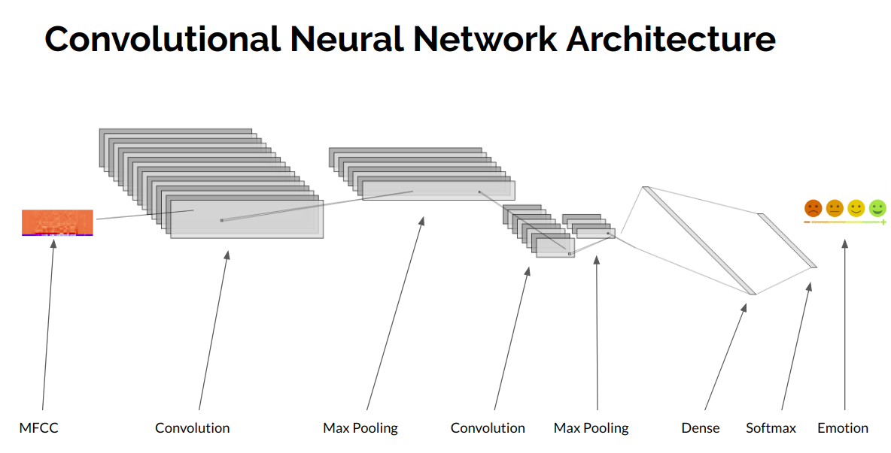
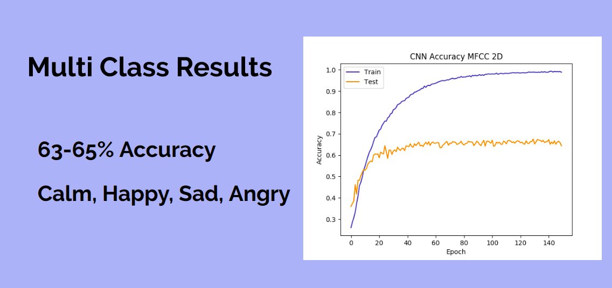

# Classifying-Emotion-with-Deep-Learning
## Problem Statement 
Emotion classification with deep learning has become a more contemporary topic in the machine learning age. There are many approaches to emotion classification with neural networks, but I wanted to see if I could classify emotion using both MFCCs and melspectograms; both are visualizations of audio files. 

## Data 
The data I used for this project is the Ryerson Audio-Visual Database of Emotional Speech and Song. There are 2000+ audio files in the database of actors and actresses singing and speaking two different phrases in eight different emotions. Go to https://zenodo.org/record/1188976#.XT5sat-YU5k for a free download of the dataset. 

## MFCCs 

  

  

## EDA 

  

### Image Augmentation 
#### Shifting 

  

#### Stretching 

  

#### Adding White Noise 

  

## Convolutional Neural Networks 

  

## Results 

  

